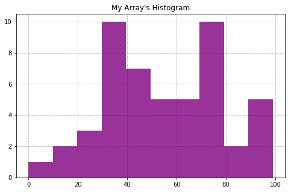
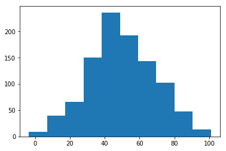
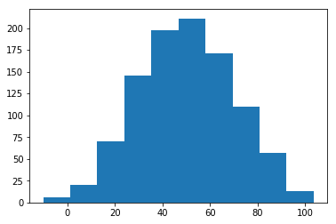
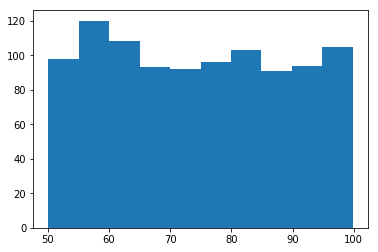
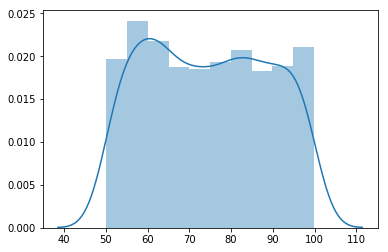
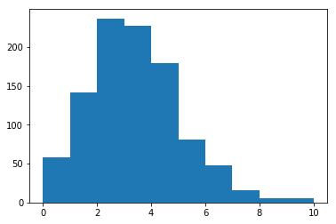
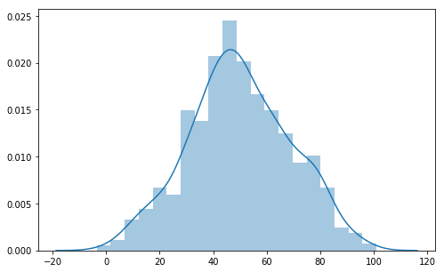

# Outline
- warmup
- questions
- review warmup
- go over normal distributions

# Questions

# Objectives
YWBAT
- explain how skewness and kurtosis scores are used in statistics
- interpret the skewness and kurtosis equations in your own words
- give an example of how normality is used in machine learning?
- play with data to make it more normal

# Warm Up
Create a random set of 50 integers between 0 and 100 using numpy. Graph them on a histogram. Then calculate their skewness and kurtosis. What do you find?



```python
import numpy as np
import pandas as pd

import scipy.stats as scs

import matplotlib.pyplot as plt
import seaborn as sns
```


```python
my_array = np.random.randint(0, 100, 50)
my_array
```


    array([96, 48, 88, 79, 31, 43, 35, 74, 87, 54, 37, 78, 16, 52, 72, 54, 61,
           36, 55, 78, 75, 24, 36, 40, 59, 67, 36, 67, 48, 10, 24, 45, 31, 73,
           74, 97,  0, 33, 41, 75, 67, 96, 27, 99, 38, 64, 77, 30, 43, 94])


## Plot our array


```python
plt.figure(figsize=(8, 5))
plt.hist(my_array, bins=10, color='purple', alpha=0.8, zorder=2)
plt.grid(linestyle='dashed', zorder=0)
plt.title("My Array's Histogram")
plt.show()
```





## calculate the skewness and kurtosis of our array

# Lesson

### creating data is really important


```python
# using numpy

# array of numbers
normal_array = np.random.normal(50, 20, 1000)
plt.hist(normal_array)
plt.show()
```





```python
# matrix of numbers

normal_matrix = np.random.normal(50, 20, (1000, 1000))
plt.hist(normal_matrix[2])
```


    (array([  6.,  20.,  70., 145., 197., 211., 171., 110.,  57.,  13.]),
     array([-10.22291419,   1.15426336,  12.53144092,  23.90861847,
             35.28579603,  46.66297358,  58.04015114,  69.41732869,
             80.79450625,  92.1716838 , 103.54886135]),
     <a list of 10 Patch objects>)





```python
normal_matrix.shape
```


    (1000, 1000)


```python
# uniform distribution

uniform_array = np.random.uniform(50, 100, 1000)
plt.hist(uniform_array)
plt.show()

# P(X1|uniform_distribution) = p
# P(X2|uniform_distribution) = p
# all events have the same frequency or probability of occuring
```





```python
sns.distplot(uniform_array)
```


    <matplotlib.axes._subplots.AxesSubplot at 0x1a22843668>





```python
# poisson
poisson_dist = np.random.poisson(3, 1000)
plt.hist(poisson_dist)
plt.show()
```





## Distributions
- defined by 'parameter(s)'
- used in various modeling scenarios

- properties
    - area under curve is 1


## Normal Distributions
- Parameters
    - $\mu$ - mean
    - $\sigma$ - standard deviation

- Properties
    - mean ~ median
    - 1 std from the mean - I get 67% of the data
    - 2 stds from the mean - I get 95% of the data
    - 3 stds from the mean - I get 99% of the data


```python
plt.figure(figsize=(8, 5))
sns.distplot(normal_array, bins=20)
plt.show()
```





# Notice this distribution is **SKEWED**

Let's interpret the math


- Numerator is calcualting the distance of a point from the mean
- then cubing that distance
    - ex if dist is 10 then dist^3 = 10000
    - ex if dist is 0.01 then dist^3 = 0.000001
- cubing the distance also retains the sign of the distance
    
- what is our sum is positive?
    - there's enough distance on the on the right to out weigh the distances on the left

- what does it mean to have a skewness of 0?
    - the right and the left are about equal in distance from the mean
    - so the points are symmetrical about the mean

# let's calculate skewness


```python
scs.skew(normal_array)
# 0.0124 -> indicates my distribution is symmetrical
```


    0.012460051614253701


# let's chat about **KURTOSIS**


- similarities to the skewness
    - taking a mean
    - dividing by standard deviation
    - getting our answer in terms of standard deviation
    
    
- What's different in this equation?
    - the exponent is 4, which means we do not preserve signs
    - our numerator is greater than or equal to 0 all the time


- what if kurtosis is 8.0?
    - this means that most of the data is within 8 stds from the mean, indicates a ton of outliers
    
- kurtosis measures the spread of the data
    - a good kurtosis score is about 3


```python
# Fisher score = Kurtosis Equation Above - 3
scs.kurtosis(normal_array)
```


    -0.33593205736746734


```python
# regular kurtosis
scs.kurtosis(normal_array, fisher=False)
```


    2.6640679426325327


# So what does it mean for data to be normal? 

Well is a distribution is normal -> 
- skew = 0
- kurt = 3 (or 0 fisher)


```python
# A better test for normality...is a shapiro test
t, p = scs.shapiro(normal_array)

p # if p < 0.5 your data is normal
```


    0.006153511814773083


```python

```
